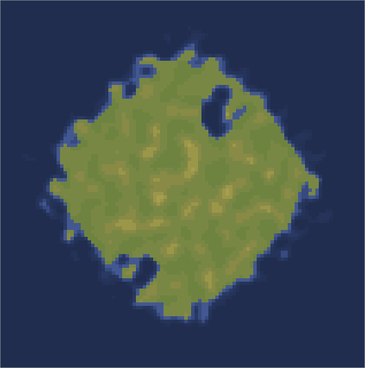

# islandboss

Using perlin and simplex noise to generate an island with climate biomes.

Thanks to [noisejs](https://github.com/josephg/noisejs) for sharing a great perlin noise library.

Take a look at the live island generator: https://gustavgb.github.io/islandboss.

I'll publish islandboss as an npm package soon.
