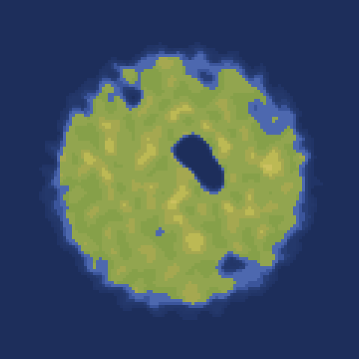

# crusoe



Generate small islands with perlin noise!

Take a look at the [live demo](https://gustavgb.github.io/crusoe/demo).

## Quick start

`npm install crusoe | yarn install crusoe`

Use with node:

```javascript
var crusoe = require('crusoe')

// Generate the island data
var map = crusoe.generateMap()

// Render island with default colors
var colors = crusoe.renderMap(map)
```

Use in browser by copying */lib/index.js*, then:

```javascript
var crusoe = window.crusoe

// Generate the island data
var map = crusoe.generateMap()

// Render island with default colors
var colors = crusoe.renderMap(map)
```

Visit [the package readme](https://www.npmjs.com/package/crusoe) for a complete documentation.

## Acknowledgements

Thanks to [noisejs](https://github.com/josephg/noisejs) for sharing a great perlin noise library.
